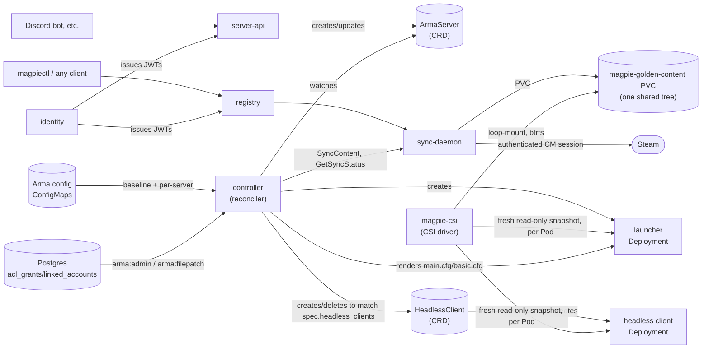

# MAGPIE

**M**anaged **A**rma **G**eneral **P**ile of **I**ntricate **E**ngineering.

Kubernetes-native orchestration for Arma 3 dedicated servers: mod/collection syncing with copy-on-write CSI snapshots, a CRD-driven reconciler, JWT-authenticated provisioning APIs, and its own OAuth2/Steam OpenID identity broker. Built as a Cargo workspace of small, single-purpose services deployed together via one Helm chart.

## Why?

Some of what's in here is more than a self-hosted Arma fleet strictly needs -- a purpose-built CSI driver, a placeholder-and-secret-aware config templating layer, its own OAuth2/OpenID identity broker. Running a handful of community game servers doesn't *require* any of that. Some of it got built anyway because the underlying problem was genuinely interesting to solve properly rather than duct-taped around, not because the requirements demanded it. If it looks over-engineered for the stated purpose in places, that's why -- and also, at some point, the acronym.

## Architecture



- **`launcher`** — launches the game server (or, in headless-client mode, connects to one) from a fresh CSI-provisioned snapshot plus a controller-rendered server config. No Steam logic of its own.
- **`sync-daemon`** — owns all Steam depot/workshop mechanics: authenticated CM session, mod/collection resolution (including private/unlisted content), and keeping one shared golden content tree in sync (on demand via `SyncContent`, or on a background timer -- `syncDaemon.contentSyncIntervalSecs`). That tree lives on a `PersistentVolumeClaim` against the `magpie-golden-content` `StorageClass`. Every `ArmaServer`'s (and `HeadlessClient`'s) own content is a separate CSI inline ephemeral volume instead -- no PVC/PV of its own at all -- a fresh read-only btrfs snapshot of the golden tree, taken by `magpie-csi` the moment its own launcher Pod is actually scheduled; `controller` gates a server's `Pending` phase on `GetSyncStatus` first, so a Pod is never scheduled against a tree still mid-download.
- **`magpie-csi`** — a small CSI driver, the one component in the stack with real host block-device access (its Node plugin, one per node, `privileged: true`): loop-mounts a growable btrfs blob per node (the blob is a regular file -- any host filesystem works as its backing store, `mkfs.btrfs` formats the loop device itself, never the host disk underneath it) so both the golden-content `PersistentVolumeClaim` and every server/headless-client's own inline ephemeral snapshot work regardless of what filesystem the host actually has. Kubelet talks to it the same conformant way it talks to any CSI driver (Identity/Controller/Node gRPC services, the standard `external-provisioner`/`node-driver-registrar` sidecars) rather than through a bespoke API -- this replaced an earlier custom Connect-RPC design (`volume-manager`) that kept hitting new host-integration failure modes (AppArmor, cgroup device allowlists, udev rules) each of which needed its own bespoke fix; CSI's job is exactly this class of problem, so the privileged pieces now follow an established, widely-used pattern instead of being reasoned about from scratch.
- **`controller`** — a `kube-runtime` reconciler that turns `ArmaServer` custom resources into launcher `Deployment`s, rendering each one's `main.cfg`/`basic.cfg` along the way (see "Arma server config" below) and provisioning the technical Postgres role `launcher`'s own Arma-side extensions connect as. Also reconciles `HeadlessClient` objects (created/deleted to match `ArmaServer.spec.headless_clients` -- a fixed count set at creation, no separate scale-in/scale-out API, no CLI/TUI wiring yet, `kubectl edit armaserver` directly) into their own Deployments, hostNetwork like the server they belong to so `-connect=127.0.0.1` just works. No external listener, no auth surface.
- **`server-api`** — JWT-authenticated `ArmaServer` CRUD plus deployment-like lifecycle (`Create`/`Start`/`Stop`/`Update`). Deliberately carries the least Kubernetes RBAC of anything here (no `Deployment` access at all) — it's the one process a stolen bearer token can reach directly.
- **`registry`** — JWT-authenticated mod source registry (a Steam mod, a collection, a preset export, or a locally-uploaded zip mod) and mission (`.pbo`) storage, backed directly by the `ModSource` CRD. Also the one place that can export/import declarative cluster state (`admin export-state`/`import-state`, `admin:export`/`admin:import` scopes) — mod source registrations, ConfigMaps, and `ArmaServer` specs, deliberately excluding synced file content, Postgres data, ACL grants, and any live credential — which is why it's also the only service besides `controller`/`server-api` with any `ArmaServer`/`ConfigMap` RBAC at all.
- **`identity`** — OAuth2 login (Discord/GitHub/Google) and Steam login (OpenID 2.0 — Steam never adopted OIDC), account linking, and JWT issuance for every JWT-gated service above to verify. The first person to ever sign in is automatically granted every permission.

All inter-service and client-facing APIs are [ConnectRPC](https://connectrpc.com/) (`proto/`) -- the one exception is `magpie-csi`, which speaks plain CSI gRPC, since kubelet (its only client) doesn't speak Connect. Mod sources (`ModSource`), servers (`ArmaServer`), and headless clients (`HeadlessClient`) are Kubernetes CRDs, not database rows — `kubectl get modsources`/`kubectl get armaservers`/`kubectl get headlessclients` shows live state directly, and `sync-daemon`/`controller` reconcile them the same way any other operator would. Postgres holds what's left: missions, ACL grants, and identities.

## Deploying

This repo is private, so every command below that talks to GitHub (not GHCR/OCI, which uses its own pull secret) picks up auth from `gh auth token` automatically if the [GitHub CLI](https://cli.github.com/) is installed and logged in (`gh auth login`) -- no separate token to export.

First install, on a fresh host with no Kubernetes yet -- either from a checkout:

```bash
./deploy/k3s-bootstrap.sh   # installs k3s, walks through required secrets
```

or with no checkout at all, piped straight from GitHub like most install.sh-style tools do it:

```bash
curl -sSf -H "Authorization: token $(gh auth token)" \
  https://raw.githubusercontent.com/skua-international/magpie/main/deploy/k3s-bootstrap.sh | bash
```

Both are the same script -- piping it in just skips needing a clone first, and it fetches `scripts/deploy.sh` (and, for `--ssh`, itself) fresh from GitHub the same way when it can't find a local copy. It ends by actually running `scripts/deploy.sh --install` for you, with every `--set` it resolved along the way.

`magpiectl install --bootstrap-k3s` (see "Installing the CLI" below) does the same first-install job as a single Go binary instead of a shell script -- installs k3s itself (data-dir and kubelet's own root-dir both pointed at `--data-dir`, not the OS disk), resolves/creates every bootstrap Secret, and runs the equivalent of `deploy --install`. `--ssh user@host` keeps the remote host's own footprint to just what genuinely has to run there: it detects the remote's architecture and downloads the matching Linux release binary directly onto it (never assumes the controlling machine's own platform matches the target's), runs *only* k3s install remotely, then fetches the resulting kubeconfig back and runs everything else -- secrets, `helm pull`/`upgrade` -- locally against it. helm/kubectl only need to be installed on whichever machine you're actually running `magpiectl` from, never the remote target.

`--bootstrap-k3s` requires passwordless sudo (locally, or for the `--ssh` user on the remote target) -- installing k3s is a genuinely root-only operation with no non-root alternative. There's no interactive password prompt (none of this works over a non-interactive `--ssh` session anyway), so a user that needs one will just fail outright rather than hang.

Upgrades (including the very first install, via `--install`) all go through one script, same pattern:

```bash
./scripts/deploy.sh                       # deploy this checkout's own chart version, same image tag
./scripts/deploy.sh 1.5.0                 # deploy a specific published version
./scripts/deploy.sh --image-tag c5130c2   # keep the chart version, swap just the images (e.g. testing an unreleased commit)
./scripts/deploy.sh --dry-run             # render + preflight without applying anything

# or, with no checkout:
curl -sSf -H "Authorization: token $(gh auth token)" \
  https://raw.githubusercontent.com/skua-international/magpie/main/scripts/deploy.sh | bash -s -- 1.5.0
```

It pulls the chart from its OCI publish (`oci://ghcr.io/skua-international/magpie/charts/magpie`) rather than the local checkout, so it always deploys the exact artifact CI published for that version — never a locally-edited template that hasn't gone through CI. With no VERSION and no local checkout to default from, it resolves the latest GitHub release instead. See `scripts/deploy.sh --help` for the rest (namespace/release name overrides, preflighting that the target image tags actually exist in GHCR before touching anything, etc). See the chart's `values.yaml` for every knob — most have sane defaults.

### Steam authentication

There's no password-based bootstrap Secret at all -- a Steam password should never reach a deployed service, not even transiently. Run `magpiectl admin refresh-steam-auth` instead: it does a QR-code login against Steam directly from `magpiectl` itself (a native Go Steam client, `cli/magpie/internal/steamlogin` -- no separate helper binary), prints the QR code (and the equivalent `https://s.team/q/1/...` URL, for a device that already has the Steam app installed), and does the whole login client-side, on your own machine. Scan it with the Steam mobile app on whichever account you want the cluster to use. Only the resulting refresh token ever reaches the cluster (written to the `arma-steam-session` Secret via the `RefreshSteamAuth` RPC, which only ever accepts a refresh token, never a password), and that's what sync-daemon uses as the cluster's Steam identity for every workshop/depot operation from then on.

This isn't elevated access — visibility into private/unlisted mods and collections is scoped to whatever that specific Steam account can actually see (its own subscriptions, friends-only shares, etc.), same as browsing the Workshop as that account normally would. Use an account that's actually subscribed to / has visibility into whatever private content the servers need.

`syncDaemon.steamAuth.anonymous: true` exists (skips `refresh-steam-auth` entirely) but can only ever sync already-public workshop mods — Steam refuses the free-license grant that makes the Arma 3 Dedicated Server depot downloadable at all ("Not for anonymous users") for anonymous sessions, confirmed live. A real deployment always needs a real account via `refresh-steam-auth` regardless — that account doesn't need to own Arma 3 itself, just not be anonymous.

### OAuth2 login (Discord/GitHub/Google)

Steam is the only login method that works out of the box — Discord/GitHub/Google are fully implemented (`services/identity/src/oauth.rs`: generic Authorization Code flow + each provider's own userinfo REST endpoint, uniformly), but each needs its own app registered with that provider (a `client_id`/`client_secret` pair), which this chart deliberately doesn't create or default for you.

To enable one or more:

1. Register an OAuth2 app with the provider(s) you want (Discord Developer Portal / GitHub OAuth Apps / Google Cloud Console), with its redirect URI set to `<identity.baseUrl>/auth/<provider>/callback` (e.g. `https://id.example.com/auth/discord/callback`).
2. Create a Secret holding whichever providers you're enabling, as `<PROVIDER>_CLIENT_ID`/`<PROVIDER>_CLIENT_SECRET` keys:
   ```bash
   kubectl create secret generic magpie-oauth -n <namespace> \
     --from-literal=DISCORD_CLIENT_ID=... --from-literal=DISCORD_CLIENT_SECRET=... \
     --from-literal=GITHUB_CLIENT_ID=...  --from-literal=GITHUB_CLIENT_SECRET=...
   ```
   Only set the pairs you actually want enabled — `identity` enables a provider only if both its keys are present (`config.rs`), and warns at startup if none are (Steam-only, same as leaving this unset entirely).
3. Set `identity.oauthSecret: magpie-oauth` (matching whatever name you used) and re-run `magpiectl upgrade`/`helm upgrade`.

### Arma server config

`controller` renders every `ArmaServer`'s `main.cfg`/`basic.cfg` from a cluster-wide baseline ConfigMap (`charts/magpie/values.yaml`'s `armaConfig` block, one per install) merged with an optional per-server override ConfigMap (`ArmaServer.spec.configMap`, same key names, per-server wins key-by-key). The rendered files land as plain files under the server's own `SERVER_ROOT/configs/` on the host — not a mounted, read-only ConfigMap volume — so they stay hand-editable in place afterward if you need to.

Every ConfigMap this creates (the baseline, and any per-server override created via `servers create`'s prompt) carries a `magpie.skua.io/field-guide` annotation -- a per-key reference visible right in `kubectl edit`'s buffer. ConfigMap `data` itself has no native comment support (`kubectl edit` fetches the live object fresh from the API, which never had any to begin with), so this is the closest achievable equivalent.

Right after a successful `magpiectl install`/`deploy`/`upgrade`, you'll be prompted to open the baseline ConfigMap in `$EDITOR` (`kubectl edit`, under the hood). Edit it again any time with:

```bash
magpiectl admin armaconfig
```

**ConfigMap keys → `main.cfg`** (see `services/controller/src/arma_config.rs` for the exact rendering):

| Key | Type | Default | main.cfg field |
|---|---|---|---|
| `hostname` | string, placeholders | *(computed, see below)* | `hostname` |
| `prefix` / `suffix` | string | `""` / `" | Powered by MAGPIE"` | *(placeholders only)* |
| `max_players` | number | `64` | `maxPlayers` |
| `force_difficulty` / `forced_difficulty` | bool / string | `false` / `"veteran"` | `forcedDifficulty` (omitted unless forced) |
| `missions_whitelist` | comma-separated list | *(empty)* | `missionWhitelist[]` |
| `persist_without_players` | bool | `false` | `persistent` |
| `use_battleEye` | bool | `false` | `BattlEye` |
| `verify_signatures` | bool | `true` | `verifySignatures` (2/0) |
| `skip_lobby` | bool | `false` | `skipLobby` |
| `allowed_file_patching` | number (0/1/2) | `1` | `allowedFilePatching` |
| `disable_von` | bool | `true` | `disableVON` |
| `kick_timeout` | `"level:seconds,..."` | `0:1,1:1,2:1,3:1` | `kickTimeout[]` |
| `allow_zeus_composition_scripts` | bool | `true` | `zeusCompositionScriptLevel` (2/0) |
| `allow_custom_glasses` | bool | `false` | `allowProfileGlasses` |
| `max_ping` | number | `300` | `MaxPing` |
| `max_packet_loss` / `max_desync` | number | *unset* | `maxPacketLoss` / `maxDesync` |
| `password_admin` / `password` / `server_command_password` | string, placeholders + secrets | `""` | same-named fields |
| `motd` | comma-separated list, placeholders | *(empty)* | `motd[]` |
| `motd_interval` | number | *unset* | `motdInterval` |
| `other_properties` | raw text | `allowedLoadFileExtensions[]`/`allowedPreprocessFileExtensions[]`/`allowedHTMLLoadExtensions[]` (see `values.yaml`) | appended verbatim at the end |

**ConfigMap keys → launch flags** (not `main.cfg`/`basic.cfg` content -- these become the launcher's own argv, same merged ConfigMap regardless):

| Key | Type | Default | Launch flag |
|---|---|---|---|
| `limit_fps` | number | `300` | `-limitFPS=` |
| `additional_params` | raw text | *(empty)* | appended verbatim after the generated `-mod=`/CDLC args -- the one way to set extra launch flags now (replaces the old per-server `spec.params` field) |

`admins[]`/`filePatchingExceptions[]` are **never** ConfigMap keys — computed on every reconcile from identities holding the `arma:admin`/`arma:filepatch` scopes (`magpiectl` doesn't grant scopes today; use `registry_db::grant_scopes` directly, or the first-ever login, which gets `*`). This reads `linked_accounts`' Steam OpenID `provider_user_id`, already the exact SteamID64 string Arma wants.

**ConfigMap keys → `basic.cfg`**: `max_msg_send`, `max_size_guaranteed`, `max_size_nonguaranteed`, `min_bandwidth`, `max_bandwidth`, `min_error_to_send`, `min_error_to_send_near`, `basic_other_properties` — all default **unset** (omitted from the file entirely, not written as `0`).

**Placeholders**, usable in `hostname`, `password`/`password_admin`/`server_command_password`, and each `motd` entry:
- `{{server_name}}` — the `ArmaServer`'s own object name
- `{{prefix}}` / `{{suffix}}` — the merged config's own `prefix`/`suffix` keys
- Sane default: `hostname = "{{prefix}}{{server_name}}{{suffix}}"` (only applied when `hostname` is entirely absent from the merge, not when it's present-but-empty)

**Secret references**: `password`-family fields and any `env.<NAME>` key (see below) may be `{{secret:<name>/<key>}}` instead of a literal value, resolved via a live lookup — but *not* against the chart's own namespace. Secrets referenceable this way live in a dedicated `magpie-user-secrets` namespace (`userSecretsNamespace` in `values.yaml`, chart-created), kept separate on purpose: an operator-controlled ConfigMap value naming a Secret to read would otherwise be able to reach `arma-postgres-creds`/`ghcr-pull-secret`/etc. alongside it. Create your own Secrets there for anything you want referenceable this way.

**Extra env vars**: any merged-config key of the form `env.<NAME>` becomes an extra `<NAME>` env var on the launcher container (same placeholder/`{{secret:...}}` support), e.g. `env.SOME_API_KEY = "{{secret:my-secret/key}}"`.

## Installing the CLI

`magpiectl` is both a direct CLI (`magpiectl servers list`, `magpiectl deploy`, ...) and, run with no subcommand, an interactive TUI — everything the TUI can do is also a direct invocation, and vice versa (see `cli/magpie/internal/actions`, the one implementation both surfaces call into). It can also drive the cluster's own lifecycle directly (`magpiectl deploy`/`upgrade`/`install`, shelling out to `helm`/`kubectl` the same way `scripts/deploy.sh` does) and establish the cluster's Steam session (`magpiectl admin refresh-steam-auth`, see "Steam authentication" above) without needing a repo checkout at all.

Download a prebuilt binary from [the latest release](https://github.com/skua-international/magpie/releases/latest). This repo is private, so the plain `.../releases/latest/download/...` URL 404s without auth -- resolve the actual asset via the API instead (needs `gh auth login` once, and `jq`):

```bash
# Linux/macOS -- picks the right archive for your OS/arch automatically
os="$(uname -s | tr '[:upper:]' '[:lower:]')"
arch="$(uname -m | sed -e 's/x86_64/amd64/' -e 's/aarch64/arm64/')"
asset="magpiectl_${os}_${arch}.tar.gz"
token="$(gh auth token)"
url="$(curl -sSf -H "Authorization: token $token" https://api.github.com/repos/skua-international/magpie/releases/latest \
  | jq -r --arg name "$asset" '.assets[] | select(.name == $name) | .url')"
curl -sSf -H "Authorization: token $token" -H 'Accept: application/octet-stream' -L "$url" \
  | tar xz -C /usr/local/bin magpiectl
```

Windows: same API dance (asset name `magpiectl_windows_amd64.zip`), or just download it from the releases page directly if you're already logged in to GitHub in your browser.

Then point it at your cluster and log in:

```bash
magpiectl --identity-url http://identity.magpie.local \
          --server-api-url http://server-api.magpie.local \
          --registry-url http://registry.magpie.local \
          auth login
magpiectl completion install   # optional -- bash/zsh/fish/powershell autocompletion
```

(Those base URLs are this chart's own `ingress.baseDomain` default, `magpie.local` — override to match whatever you actually set at install time. `http://` above matches that local default; a real public deployment sets `ingress.tls.enabled: true` plus `ingress.tls.clusterIssuer` to a cert-manager `ClusterIssuer` already installed in the cluster, and every generated Ingress picks up a real cert instead — needed for Steam OAuth login to work for anyone off the local network at all, since `identity`'s callback URL has to actually be reachable from wherever the browser is.)

Building from source instead (e.g. to run an unreleased commit): `cd cli/magpie && go install ./cmd/magpiectl` -- only works from within a clone of this monorepo, since `cli/magpie`'s `go.mod` points at `generated/go` via a relative `replace` directive rather than a published module.

## Repo layout

```
crates/                shared library crates (steam-sync, registry-db, authn, protocol, crd, ...)
services/              the service binaries described above (including magpie-csi)
cli/magpie/            the magpie CLI/TUI (Go)
proto/                 ConnectRPC service definitions
charts/magpie/         the Helm chart
deploy/                k3s-bootstrap.sh
scripts/               deploy.sh
Dockerfile.workspace   compiles every service binary in one build (see Development below)
```

## Development

```bash
cargo check --workspace
cargo test --workspace
cargo clippy --workspace --all-targets
```

All 7 service binaries are compiled once, together, by `Dockerfile.workspace` (`cargo-chef` for dependency-layer caching, built from the repo root — every service needs the full workspace's `Cargo.lock`/manifests to resolve), rather than each service having its own multi-stage Rust build. Each `services/*/Dockerfile` is just a thin packaging step on top of that -- `COPY` the already-built binary plus whatever runtime `apt` packages it needs, nothing else. `.github/workflows/build-images.yml` runs `Dockerfile.workspace` once (`build-workspace`) on push to `main`, hands the resulting binaries to the 7 packaging builds as a job artifact, and pushes every image to `ghcr.io/skua-international/magpie/*`. Release tags are a separate, manually-triggered promotion step (`.github/workflows/release.yml`) that retags/republishes what a passing commit already built, rather than rebuilding anything.
